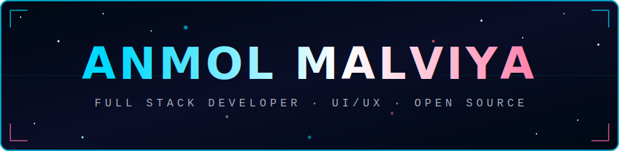

<div align="center">

</div>

<div align="center">

</div>

<br/>

<div align="center">

[](https://anmolmalviya.vercel.app)
[](https://linkedin.com/in/anmol-malviya)
[](https://github.com/Anmol-Malviya)


</div>

---

## 🧑‍💻 About Me

```js
const anmol = {
  name    : "Anmol Malviya",
  role    : "Full Stack Developer",
  location: "India 🇮🇳",
  working : "React · Node.js · MongoDB full-stack apps",
  learning: ["AI Integration", "System Design", "Performance Optimization"],
  collab  : "Open-source, startups & innovative web ideas",
  ask_me  : ["React", "Node.js", "APIs", "MongoDB", "UI/UX"],
  fun_fact: "I debug with console.log and I'm not ashamed 😄"
};
```

---

## 🎮 Auto-Playing Space Invaders Game

<div align="center">


> *Enemies march, lasers fire, ship dodges — all animated with pure SVG! 🚀*
</div>

---

## 🐍 Snake Eating My Contributions

<div align="center">

</div>

---

## 💻 Tech Stack

<div align="center">

### 🚀 Frontend


### ⚙️ Backend


### 🗄️ Databases & Cloud


### 🛠️ Tools


</div>

---

## 📊 Skill Proficiency

<div align="center">
<svg width="700" height="290" viewBox="0 0 700 290" xmlns="http://www.w3.org/2000/svg">
  <defs>
    <linearGradient id="bar" x1="0%" y1="0%" x2="100%" y2="0%">
      <stop offset="0%" style="stop-color:#00d9ff"/>
      <stop offset="100%" style="stop-color:#ff6b9d"/>
    </linearGradient>
  </defs>
  <rect width="700" height="290" rx="12" fill="#0d1117"/>
  <text x="350" y="28" fill="#00d9ff" font-family="monospace" font-size="13" text-anchor="middle" font-weight="bold" letter-spacing="3">SKILL PROFICIENCY</text>
  <!-- React -->
  <text x="20" y="58" fill="#abb2bf" font-family="monospace" font-size="12">React / Next.js</text>
  <text x="680" y="58" fill="#00d9ff" font-family="monospace" font-size="12" text-anchor="end">92%</text>
  <rect x="20" y="64" width="660" height="10" rx="5" fill="#1a2a3a"/>
  <rect x="20" y="64" width="0" height="10" rx="5" fill="url(#bar)"><animate attributeName="width" from="0" to="607" dur="1.8s" fill="freeze" begin="0.2s"/></rect>
  <!-- Node.js -->
  <text x="20" y="98" fill="#abb2bf" font-family="monospace" font-size="12">Node.js / Express</text>
  <text x="680" y="98" fill="#00d9ff" font-family="monospace" font-size="12" text-anchor="end">88%</text>
  <rect x="20" y="104" width="660" height="10" rx="5" fill="#1a2a3a"/>
  <rect x="20" y="104" width="0" height="10" rx="5" fill="url(#bar)"><animate attributeName="width" from="0" to="581" dur="1.8s" fill="freeze" begin="0.4s"/></rect>
  <!-- MongoDB -->
  <text x="20" y="138" fill="#abb2bf" font-family="monospace" font-size="12">MongoDB / SQL</text>
  <text x="680" y="138" fill="#00d9ff" font-family="monospace" font-size="12" text-anchor="end">85%</text>
  <rect x="20" y="144" width="660" height="10" rx="5" fill="#1a2a3a"/>
  <rect x="20" y="144" width="0" height="10" rx="5" fill="url(#bar)"><animate attributeName="width" from="0" to="561" dur="1.8s" fill="freeze" begin="0.6s"/></rect>
  <!-- TypeScript -->
  <text x="20" y="178" fill="#abb2bf" font-family="monospace" font-size="12">TypeScript</text>
  <text x="680" y="178" fill="#00d9ff" font-family="monospace" font-size="12" text-anchor="end">82%</text>
  <rect x="20" y="184" width="660" height="10" rx="5" fill="#1a2a3a"/>
  <rect x="20" y="184" width="0" height="10" rx="5" fill="url(#bar)"><animate attributeName="width" from="0" to="541" dur="1.8s" fill="freeze" begin="0.8s"/></rect>
  <!-- Python -->
  <text x="20" y="218" fill="#abb2bf" font-family="monospace" font-size="12">Python / Django</text>
  <text x="680" y="218" fill="#00d9ff" font-family="monospace" font-size="12" text-anchor="end">78%</text>
  <rect x="20" y="224" width="660" height="10" rx="5" fill="#1a2a3a"/>
  <rect x="20" y="224" width="0" height="10" rx="5" fill="url(#bar)"><animate attributeName="width" from="0" to="515" dur="1.8s" fill="freeze" begin="1.0s"/></rect>
  <!-- UI/UX -->
  <text x="20" y="258" fill="#abb2bf" font-family="monospace" font-size="12">UI/UX / Figma</text>
  <text x="680" y="258" fill="#00d9ff" font-family="monospace" font-size="12" text-anchor="end">80%</text>
  <rect x="20" y="264" width="660" height="10" rx="5" fill="#1a2a3a"/>
  <rect x="20" y="264" width="0" height="10" rx="5" fill="url(#bar)"><animate attributeName="width" from="0" to="528" dur="1.8s" fill="freeze" begin="1.2s"/></rect>
</svg>
</div>

---

## 📈 GitHub Statistics

<div align="center">


</div>

<div align="center">

</div>

---

## 🏆 GitHub Trophies

<div align="center">

</div>

---

## 🔥 Contribution Graph

<div align="center">

</div>

---

## 💡 Quote of the Day

<div align="center">

</div>

---

<div align="center">

</div>
