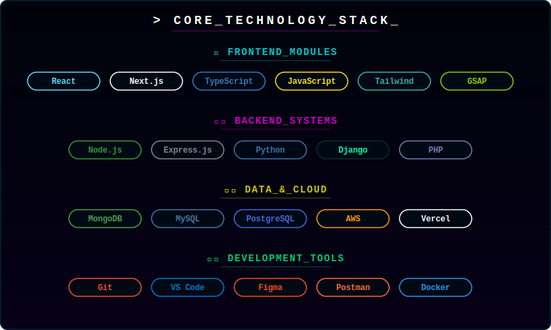
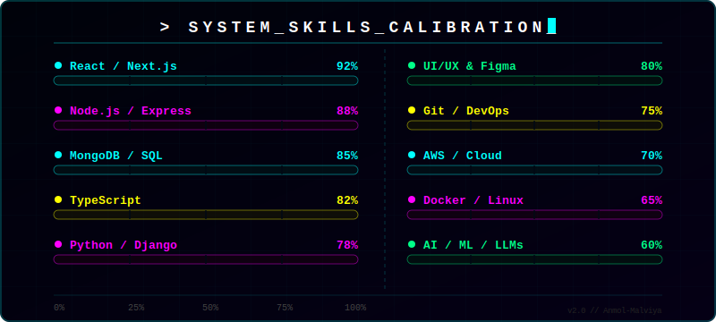
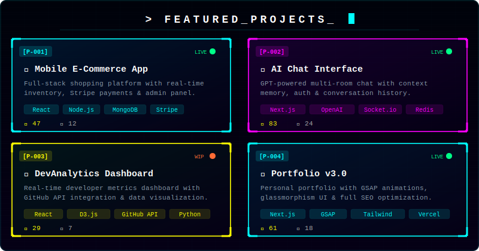
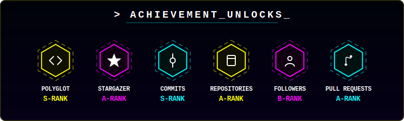

<div align="center">

</div>

<div align="center">

</div>

<br/>

<div align="center">

[](https://anmolmalviya.vercel.app)
[](https://linkedin.com/in/anmol-malviya)
[](https://github.com/Anmol-Malviya)


</div>

---

## 🧑‍💻 About Me

```js
const anmol = {
  name    : "Anmol Malviya",
  role    : "Full Stack Developer",
  location: "India 🇮🇳",
  working : "React · Node.js · MongoDB full-stack apps",
  learning: ["AI Integration", "System Design", "Performance Optimization"],
  collab  : "Open-source, startups & innovative web ideas",
  ask_me  : ["React", "Node.js", "APIs", "MongoDB", "UI/UX"],
  fun_fact: "I debug with console.log and I'm not ashamed 😄"
};
```

---

## 🎮 Auto-Playing Space Invaders Game

<div align="center">


> *Enemies march, lasers fire, ship dodges — all animated with pure SVG! 🚀*
</div>

---

## 🐍 Snake Eating My Contributions

<div align="center">

</div>

---

## 💻 Tech Stack

<div align="center">

</div>

---

## 📊 Skill Proficiency

<div align="center">

</div>

---

## 🚀 Featured Projects

<div align="center">

</div>

---

## 📈 GitHub Statistics

<div align="center">


</div>

<div align="center">

</div>

---

## 🏆 GitHub Trophies

<div align="center">

</div>

---

## 🔥 Contribution Graph

<div align="center">

</div>

---

## 💡 Quote of the Day

<div align="center">

</div>

---

<div align="center">

</div>
