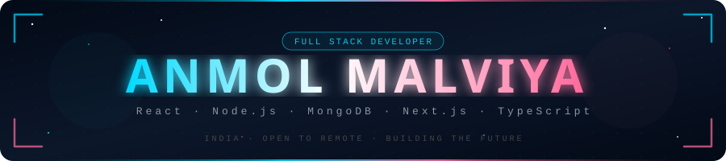
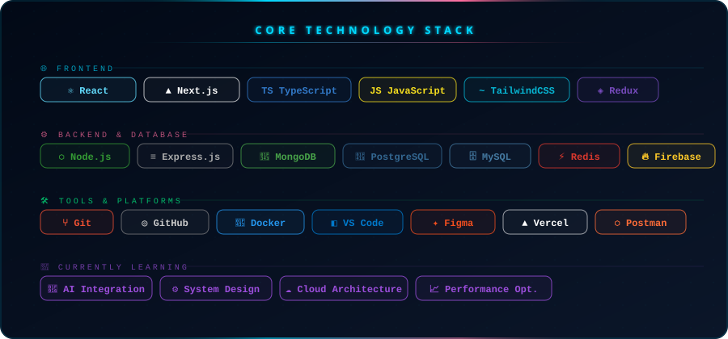
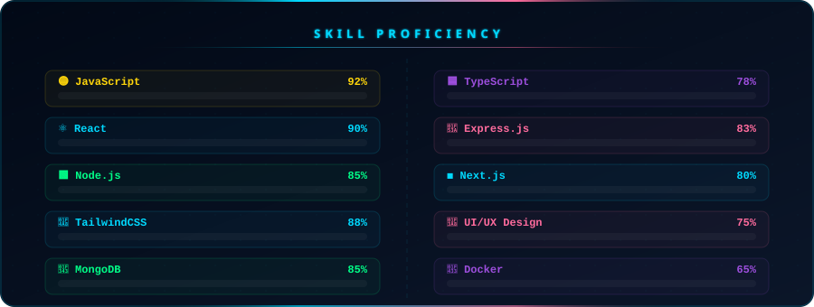
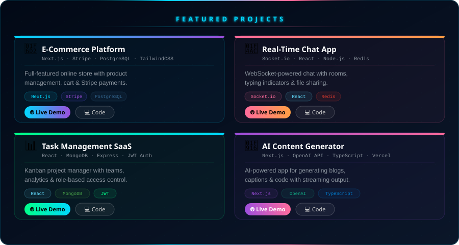
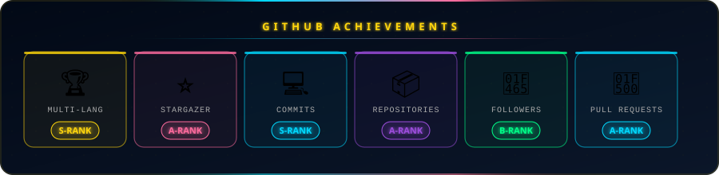

<!-- ═══════════════════════════════════════════════════════════════ -->
<!--                        HEADER BANNER                          -->
<!-- ═══════════════════════════════════════════════════════════════ -->

<div align="center">
  
</div>

<br/>

<!-- ═══════════════════════════════════════════════════════════════ -->
<!--                     TYPING ANIMATION                          -->
<!-- ═══════════════════════════════════════════════════════════════ -->

<div align="center">
  
</div>

<br/>

<!-- ═══════════════════════════════════════════════════════════════ -->
<!--                      STATUS BADGES                            -->
<!-- ═══════════════════════════════════════════════════════════════ -->

<div align="center">

[](https://anmolmalviya.vercel.app)&nbsp;
[](https://linkedin.com/in/anmol-malviya)&nbsp;
[](https://github.com/Anmol-Malviya)&nbsp;
[](mailto:anmolmalviya@example.com)

<br/>

&nbsp;
&nbsp;


</div>

<br/>

---

<!-- ═══════════════════════════════════════════════════════════════ -->
<!--                       QUICK STATS                             -->
<!-- ═══════════════════════════════════════════════════════════════ -->

<div align="center">

<table>
  <tr>
    <td align="center" width="160">
      
      <br/><sub><b>Projects Built</b></sub>
    </td>
    <td align="center" width="160">
      
      <br/><sub><b>Years Coding</b></sub>
    </td>
    <td align="center" width="160">
      
      <br/><sub><b>Technologies</b></sub>
    </td>
    <td align="center" width="160">
      
      <br/><sub><b>Contributions</b></sub>
    </td>
    <td align="center" width="160">
      
      <br/><sub><b>Based In</b></sub>
    </td>
  </tr>
</table>

</div>

---

<!-- ═══════════════════════════════════════════════════════════════ -->
<!--                        ABOUT ME                               -->
<!-- ═══════════════════════════════════════════════════════════════ -->

## `< About Me />`

```javascript
const anmol = {
  name     : "Anmol Malviya",
  role     : "Full Stack Developer & Software Engineer",
  location : "India 🇮🇳  ·  Open to Remote",
  stack    : ["React", "Next.js", "Node.js", "MongoDB", "TypeScript"],
  learning : ["AI Integration", "System Design", "Cloud Architecture"],
  collab   : "Open-source projects, startups & innovative web ideas",
  askMeAbout: ["React", "Node.js", "REST APIs", "MongoDB", "UI/UX"],
  funFact  : "I debug with console.log and I'm not ashamed 😄",
  mission  : "Building digital experiences that make a real difference 🌍",
  available: true,
};
```

<br/>

<div align="center">

| 🎯 Current Focus | 🌱 Learning | 🤝 Looking For | ⚡ Fun Fact |
|:---:|:---:|:---:|:---:|
| Full Stack & AI Apps | System Design · Cloud | Collabs · OSS · Freelance | ☕ → Clean Code |

</div>

---

<!-- ═══════════════════════════════════════════════════════════════ -->
<!--                      TECH STACK SVG                           -->
<!-- ═══════════════════════════════════════════════════════════════ -->

## `< Tech Stack />`

<div align="center">
  
</div>

<br/>

<div align="center">

### 🌐 Frontend


### ⚙️ Backend & Database


### 🛠️ Tools & Platforms


</div>

---

<!-- ═══════════════════════════════════════════════════════════════ -->
<!--                    SKILL PROFICIENCY                          -->
<!-- ═══════════════════════════════════════════════════════════════ -->

## `< Skill Proficiency />`

<div align="center">
  
</div>

---

<!-- ═══════════════════════════════════════════════════════════════ -->
<!--                    GITHUB STATISTICS                          -->
<!-- ═══════════════════════════════════════════════════════════════ -->

## `< GitHub Statistics />`

<div align="center">

<a href="https://github.com/Anmol-Malviya">
  
</a>
<a href="https://github.com/Anmol-Malviya">
  
</a>

</div>

<br/>

<div align="center">
  
</div>

---

<!-- ═══════════════════════════════════════════════════════════════ -->
<!--                     FEATURED PROJECTS                         -->
<!-- ═══════════════════════════════════════════════════════════════ -->

## `< Featured Projects />`

<div align="center">
  
</div>

<br/>

<div align="center">

<table>
  <tr>
    <td width="50%" valign="top">
      <h3>🛒 E-Commerce Platform</h3>
      <p>Full-featured online store with product management, shopping cart, Stripe payment gateway, and admin dashboard built for scale.</p>
      <p>
        
        
        
        
      </p>
      <a href="https://anmolmalviya.vercel.app"></a>
      <a href="https://github.com/Anmol-Malviya"></a>
    </td>
    <td width="50%" valign="top">
      <h3>💬 Real-Time Chat App</h3>
      <p>WebSocket-powered messaging app with rooms, typing indicators, file sharing, and persistent message history using Redis caching.</p>
      <p>
        
        
        
        
      </p>
      <a href="https://anmolmalviya.vercel.app"></a>
      <a href="https://github.com/Anmol-Malviya"></a>
    </td>
  </tr>
  <tr>
    <td width="50%" valign="top">
      <h3>📊 Task Management SaaS</h3>
      <p>Kanban project manager with team collaboration, real-time drag-and-drop updates, advanced analytics, and role-based access control.</p>
      <p>
        
        
        
        
      </p>
      <a href="https://anmolmalviya.vercel.app"></a>
      <a href="https://github.com/Anmol-Malviya"></a>
    </td>
    <td width="50%" valign="top">
      <h3>🤖 AI Content Generator</h3>
      <p>AI-powered web app for generating blogs, social captions, and code snippets using OpenAI API with real-time streaming output.</p>
      <p>
        
        
        
        
      </p>
      <a href="https://anmolmalviya.vercel.app"></a>
      <a href="https://github.com/Anmol-Malviya"></a>
    </td>
  </tr>
  <tr>
    <td width="50%" valign="top">
      <h3>🌐 Developer Portfolio</h3>
      <p>This very portfolio! Built with Next.js, Framer Motion animations, TailwindCSS, and 3D WebGL effects for a stunning experience.</p>
      <p>
        
        
        
        
      </p>
      <a href="https://anmolmalviya.vercel.app"></a>
      <a href="https://github.com/Anmol-Malviya"></a>
    </td>
    <td width="50%" valign="top">
      <h3>📱 Social Media Dashboard</h3>
      <p>Analytics dashboard aggregating data from multiple platforms with interactive D3.js charts, filters, and CSV export functionality.</p>
      <p>
        
        
        
        
      </p>
      <a href="https://anmolmalviya.vercel.app"></a>
      <a href="https://github.com/Anmol-Malviya"></a>
    </td>
  </tr>
</table>

</div>

---

<!-- ═══════════════════════════════════════════════════════════════ -->
<!--                    GITHUB ACHIEVEMENTS                        -->
<!-- ═══════════════════════════════════════════════════════════════ -->

## `< GitHub Achievements />`

<div align="center">
  
</div>

---

<!-- ═══════════════════════════════════════════════════════════════ -->
<!--                   CONTRIBUTION ACTIVITY                       -->
<!-- ═══════════════════════════════════════════════════════════════ -->

## `< Contribution Activity />`

<div align="center">
  
</div>

<br/>

<div align="center">
  
</div>

---

<!-- ═══════════════════════════════════════════════════════════════ -->
<!--                       WHAT I'M UP TO                          -->
<!-- ═══════════════════════════════════════════════════════════════ -->

## `< Currently />`

<div align="center">

```
🔭  Building    →  Scalable full-stack apps with React & Node.js
🌱  Learning    →  AI/ML Integration · System Design · Cloud Architecture
👯  Collab On   →  Open-source, startups & creative web ideas
💬  Ask Me      →  React · Node.js · MongoDB · REST APIs · UI/UX Design
⚡  Fun Fact    →  I turn coffee ☕ into clean, efficient code
🎯  Goal        →  Build products that make a real difference 🌍
```

</div>

---

<!-- ═══════════════════════════════════════════════════════════════ -->
<!--                      QUOTE OF THE DAY                         -->
<!-- ═══════════════════════════════════════════════════════════════ -->

## `< Quote />`

<div align="center">
  
</div>

---

<!-- ═══════════════════════════════════════════════════════════════ -->
<!--                       CONNECT WITH ME                         -->
<!-- ═══════════════════════════════════════════════════════════════ -->

## `< Let's Connect />`

<div align="center">

<a href="https://linkedin.com/in/anmol-malviya">
  
</a>&nbsp;
<a href="https://github.com/Anmol-Malviya">
  
</a>&nbsp;
<a href="https://anmolmalviya.vercel.app">
  
</a>&nbsp;
<a href="mailto:anmolmalviya@example.com">
  
</a>&nbsp;
<a href="https://twitter.com/anmolmalviya">
  
</a>

<br/><br/>

> **"Code is like humor. When you have to explain it, it's bad."** — *Cory House*

> **"First, solve the problem. Then, write the code."** — *John Johnson*

> **"The best way to predict the future is to invent it."** — *Alan Kay*

<br/>


</div>
