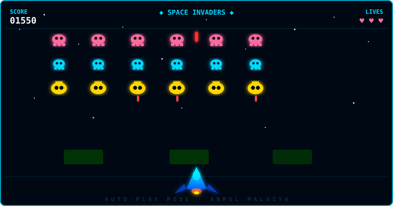

<div align="center">

</div>

<div align="center">

</div>

<br/>

<div align="center">

[](https://anmolmalviya.vercel.app)
[](https://linkedin.com/in/anmol-malviya)
[](https://github.com/Anmol-Malviya)
[](mailto:anmolmalviya@example.com)


</div>

---

<div align="center">

## `< About Me />`

</div>

```javascript
const anmol = {
  name    : "Anmol Malviya",
  role    : "Full Stack Developer & Software Engineer",
  location: "India 🇮🇳",
  working : "React · Node.js · MongoDB · Next.js full-stack apps",
  learning: ["AI Integration", "System Design", "Performance Optimization"],
  collab  : "Open-source, startups & innovative web ideas",
  ask_me  : ["React", "Node.js", "REST APIs", "MongoDB", "UI/UX Design"],
  fun_fact: "I debug with console.log and I'm not ashamed 😄",
  mission : "Building digital experiences that make a difference 🌍"
};
```

<br/>

<table align="center" width="100%">
  <tr>
    <td align="center" width="33%">
      <br/>
      <strong>🎯 Focus</strong><br/>
      Full Stack Development
    </td>
    <td align="center" width="33%">
      <br/>
      <strong>⏱️ Experience</strong><br/>
      2+ Years Coding
    </td>
    <td align="center" width="33%">
      <br/>
      <strong>🚀 Projects</strong><br/>
      15+ Apps Built
    </td>
  </tr>
</table>

---

<div align="center">

## `< Space Game />`

</div>

<div align="center">


> *Enemies march, lasers fire, ship dodges — all animated with pure SVG! 🚀*
</div>

---

<div align="center">

## `< Tech Stack />`

</div>

<div align="center">

### 🌐 Frontend


### ⚙️ Backend & Database


### 🛠️ Tools & Platforms


</div>

---

<div align="center">

## `< Skill Proficiency />`

</div>

<div align="center">

</div>

---

<div align="center">

## `< Featured Projects />`

</div>

<div align="center">

</div>

<br/>

<div align="center">

| 🚀 Project | 🛠️ Stack | 🌐 Live | 📁 Code |
|:---:|:---:|:---:|:---:|
| **Full Stack Web App** | React · Node.js · MongoDB | [Demo](https://anmolmalviya.vercel.app) | [Repo](https://github.com/Anmol-Malviya) |
| **E-Commerce Platform** | Next.js · Stripe · PostgreSQL | [Demo](https://anmolmalviya.vercel.app) | [Repo](https://github.com/Anmol-Malviya) |
| **Real-Time Chat App** | Socket.io · Express · Redis | [Demo](https://anmolmalviya.vercel.app) | [Repo](https://github.com/Anmol-Malviya) |
| **Developer Portfolio** | Next.js · TailwindCSS · Framer | [Demo](https://anmolmalviya.vercel.app) | [Repo](https://github.com/Anmol-Malviya) |

</div>

---

<div align="center">

## `< GitHub Statistics />`

</div>

<div align="center">


</div>

<br/>

<div align="center">

</div>

---

<div align="center">

## `< Contribution Graph />`

</div>

<div align="center">

</div>

---

<div align="center">

## `< GitHub Trophies />`

</div>

<div align="center">

</div>

---

<div align="center">

## `< Snake Eating Contributions />`

</div>

<div align="center">

</div>

---

<div align="center">

## `< What I'm Up To />`

</div>

<div align="center">

```
🔭 Currently Building  →  Scalable full-stack web apps with React & Node.js
🌱 Currently Learning  →  AI/ML Integration · System Design · Cloud Architecture
👯 Looking to Collab   →  Open-source projects · Startups · Innovative ideas
💬 Ask Me About        →  React · Node.js · MongoDB · REST APIs · UI/UX
⚡ Fun Fact            →  I turn coffee ☕ into clean, efficient code
```

</div>

---

<div align="center">

## `< Quote of the Day />`

</div>

<div align="center">

</div>

---

<div align="center">

## `< Let's Connect />`

<br/>

<a href="https://linkedin.com/in/anmol-malviya">

</a>
&nbsp;
<a href="https://github.com/Anmol-Malviya">

</a>
&nbsp;
<a href="https://anmolmalviya.vercel.app">

</a>
&nbsp;
<a href="mailto:anmolmalviya@example.com">

</a>

<br/><br/>

> **"Code is like humor. When you have to explain it, it's bad."** – Cory House

<br/>


</div>
